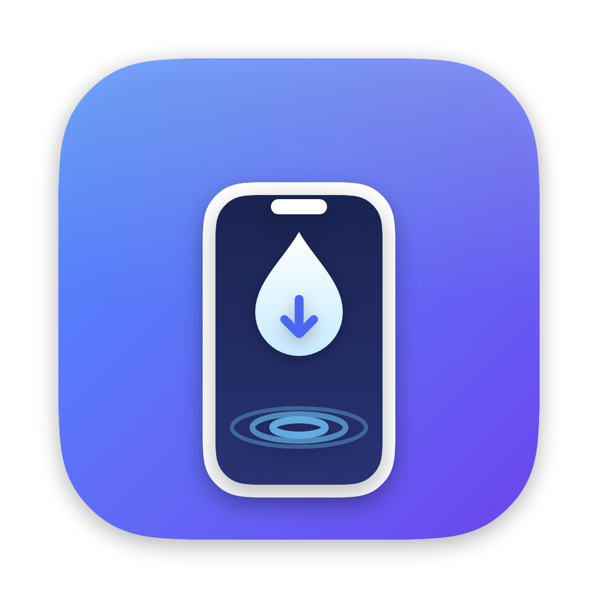
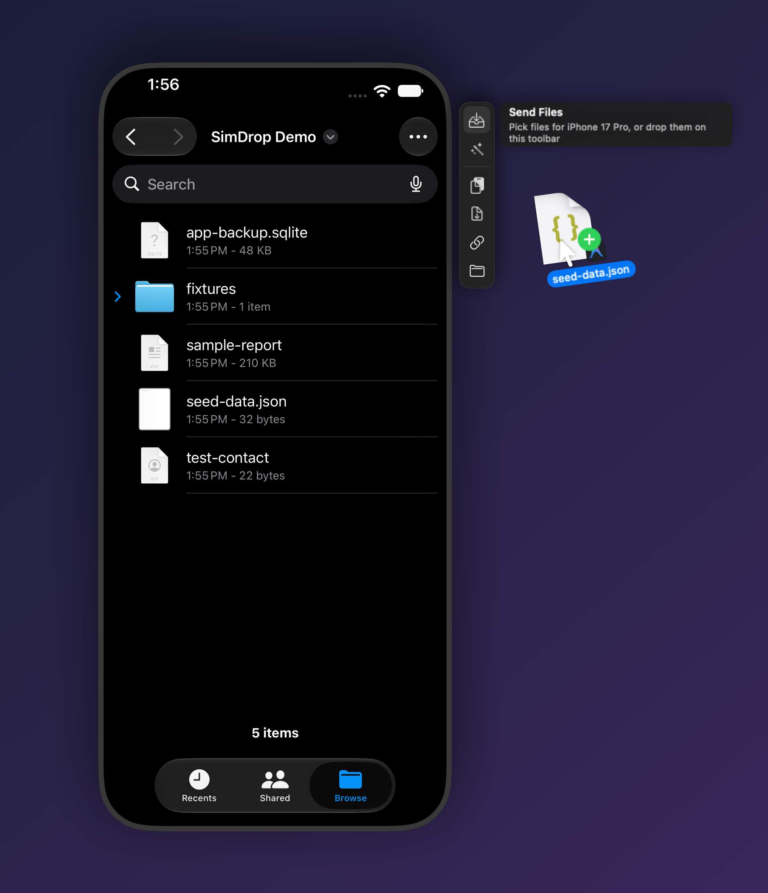
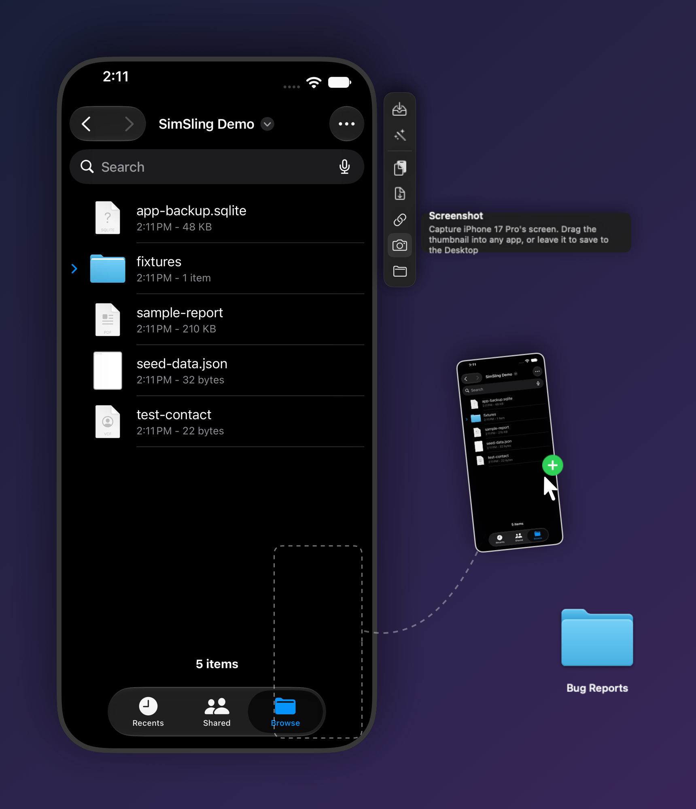

<p align="center">
  
</p>

<h1 align="center">SimSling</h1>

<p align="center">
  Sling files into iOS simulators.<br>
  A menu bar app, a floating toolbar docked beside each simulator, and a CLI for the Xcode 27 Device Hub.
</p>

<p align="center">
  
</p>

## Why

In Xcode 27 the simulator lives in **Device Hub**, and getting arbitrary files into it got harder:
drag and drop is ignored, there's no "share with simulator" in Finder, and Finder copies into the
simulator's storage can land as zero-byte files
([developer.apple.com/forums/thread/846994](https://developer.apple.com/forums/thread/846994)).

SimSling writes straight into the Files app's **On My iPhone** storage with `rsync`, and uses
`simctl` for everything else.

## Features

**Floating toolbar.** A slim toolbar docks beside every open simulator window and follows it as you
move it (it flips to the left when there's no room on the right). It sits just above its own
window, not over everything, and never steals focus from the simulator. Hover a button to see
what it does. Everything on a toolbar acts on **that simulator only**.

| Button | Does |
| --- | --- |
| Send Files | Pick files, or drop files anywhere on the toolbar |
| Destination | Auto, Files, Photos, or an app's Documents folder |
| Paste Mac Clipboard | Put the Mac clipboard onto the simulator |
| Copy Sim Clipboard | Bring the simulator's clipboard to the Mac |
| Open URL | Open a URL or deep link |
| Screenshot | Capture the screen; a thumbnail floats in the simulator's corner ([see below](#screenshots)) |
| Show in Finder | Reveal the simulator's Files storage |

**Menu bar app.** Drop files on the menu bar icon or in its panel to send them to every checked
booted simulator. The ⋯ menu turns the floating toolbar on or off.

**Auto routing.**

| Drop | Goes to |
| --- | --- |
| Images, videos, `.vcf` | Photos / Contacts (`simctl addmedia`) |
| `.app` bundle | Installed (`simctl install`) |
| Anything else, including folders | Files › On My iPhone |

## Screenshots

Screenshots work the way they did in Simulator.app before Device Hub. Click the camera on a
simulator's toolbar: the screen flashes, and a thumbnail floats in the simulator's bottom-right
corner. Take a few and they stack up.

<p align="center">
  
</p>

| Do this with the thumbnail | What happens |
| --- | --- |
| Drag it into any app (Slack, Figma, Xcode, a Finder folder…) | The app gets the image; no copy is left on your Mac |
| Leave it alone | Saved to the Desktop after 5 seconds (hovering keeps it around) |
| Click it | Saved to the Desktop and opened |
| Right-click it | Save to Desktop, Copy, or Delete |

Files use Simulator.app's naming, e.g. `Simulator Screenshot - iPhone 17 Pro - 2026-09-25 at 14.30.05.png`.
From the terminal, `simsling screenshot` does the same (to the Desktop, or a path you give it).

## Install

### Download

Grab **SimSling-x.y.z.zip** from the [latest release](https://github.com/ketanchoyal/SimSling/releases/latest),
unzip it and move **SimSling.app** to Applications. It's a universal build (Apple Silicon and Intel)
for macOS 15 or later, and needs Xcode installed for `xcrun simctl`.

SimSling is ad-hoc signed and not notarized, so macOS blocks the first launch. Either open it once
and then click **Open Anyway** in **System Settings › Privacy & Security**, or run:

```sh
xattr -dr com.apple.quarantine /Applications/SimSling.app
```

### Build from source

```sh
git clone https://github.com/ketanchoyal/SimSling.git
cd SimSling
./scripts/build-app.sh            # -> build/SimSling.app
cp -R build/SimSling.app /Applications/
open /Applications/SimSling.app
```

To publish a release: bump `VERSION`, then run `./scripts/release.sh`.

**Accessibility permission.** With more than one simulator booted, the floating toolbar reads each
simulator window's title (e.g. "iPhone 17 Pro – iOS 27.0") through Accessibility to know which
device it belongs to. SimSling asks on first launch; you can also allow it under
**System Settings › Privacy & Security › Accessibility**. Because release builds are ad-hoc signed,
macOS may ask again after an update.

## CLI

The app binary doubles as a CLI:

```sh
ln -s /Applications/SimSling.app/Contents/MacOS/SimSling /usr/local/bin/simsling

simsling list
simsling send backup.dat photos/*.heic          # all booted sims, auto-routed
simsling send -d "iPhone 17 Pro" --files data/
simsling send --app com.example.myapp seed.sqlite
simsling clip-to-sim
simsling clip-from-sim
simsling open "myapp://settings"
simsling screenshot                            # to the Desktop, Simulator.app naming
```

## License

MIT
